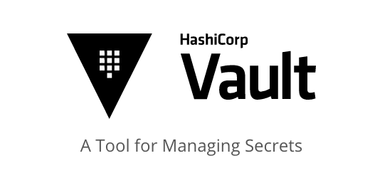

# Terraform-Vault-AWS

 

# installation 
you can install vault directly in your laptop, just go to the link below and find the installation method exactly for your environment.
[https://learn.hashicorp.com/tutorials/vault/getting-started-install](https://learn.hashicorp.com/tutorials/vault/getting-started-install)

# First steps
run the `vault server -dev` command to run the vault. 

 You will see Vault server launch and wait log actions to
 the current console window. Scroll up to find the unseal
 key and the root token. You're going to need the token . you can see I've put my token to the my_tokens.txt file.

you need to save two variable here. root token and vault address, then you can easily start your vault and believe me you need to tell to your vault to go and use the http because the default address that vault is using is the https and because you are running the vault directly in your computer, so you are going for http .

 Open a second console and save the token in a variable
 DO NOT USE `‍‍ VAULT_TOKEN ` for the variable name
‍‍‍‍
 ` export root_token="ROOT_TOKEN_VALUE" `

` vault login -address="http://127.0.0.1:8200" $root_token`

 Adding the `--address` flag everytime is a drag. Let's use environment variable so the vault CLI knows where to contact the Vault server.

` export VAULT_ADDR="http://127.0.0.1:8200" `
 

because you have configured the VAULT_ADDR and root_token so you can use the command below to start your vault

` vault login $root_token `

then you can run vault status to see your vault status 

` vault status `

# open vault ui 
if you want to open vault ui, only needs to go the address below and use your current token. because you don't have any other authentication method in the first place , you have to use the token.

Now open a browser on http://127.0.0.1:8200/ui

# Terraform cloud account for the backend 
by the way, I've configured the terraform remote backend on the terraform cloud. 
it's so easy to create a new account on the terraform cloud and then write `terraform login` and create a token from your terraform cloud's profile page and enter it in the terminal and it's all set.

